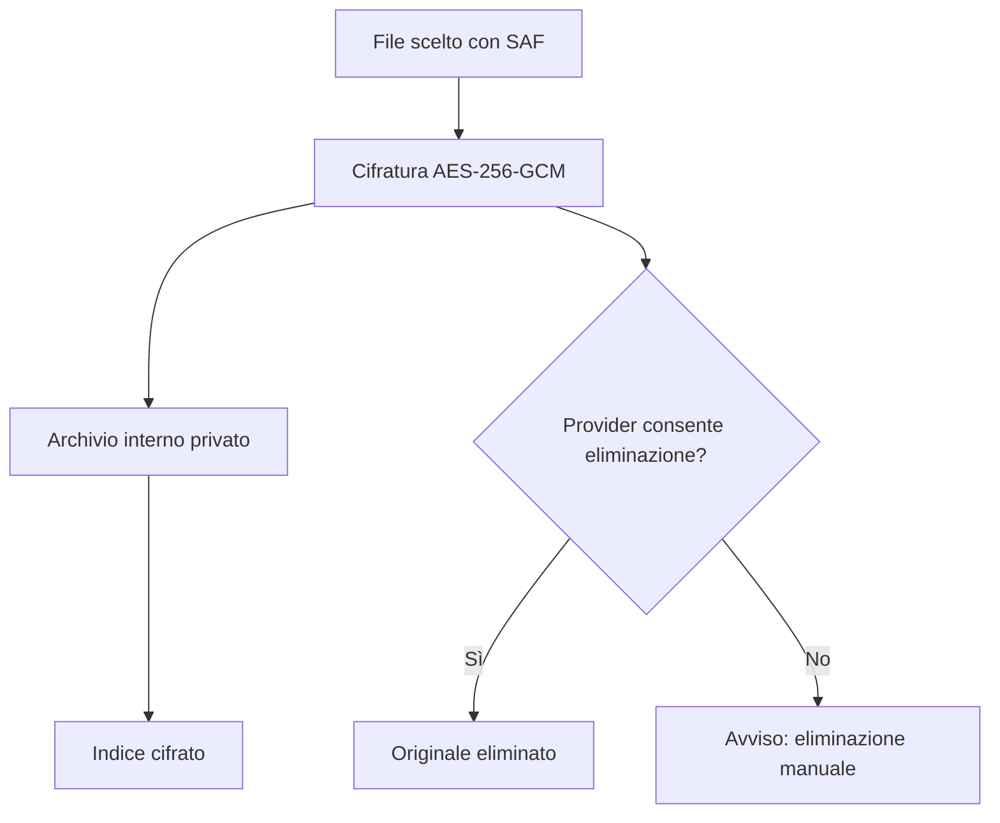
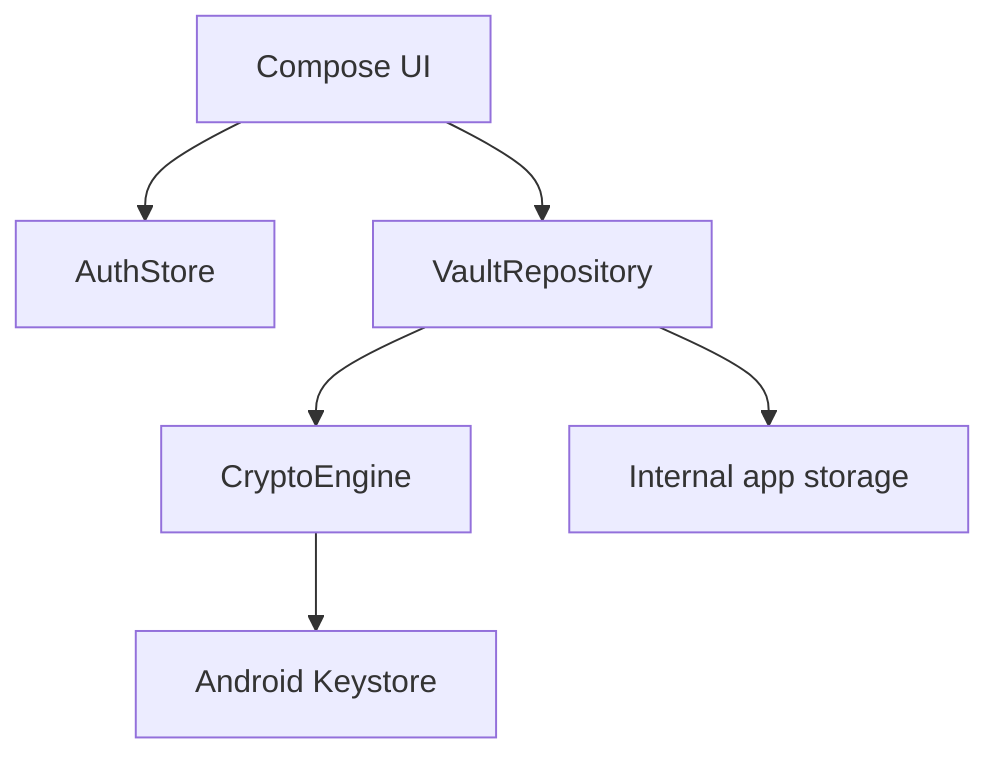

# Product & Security Specification — Fort Knox Vault

## 1. Scopo

Applicazione Android privata che importa foto, video e documenti in un archivio
interno cifrato. L’obiettivo non è “nascondere” i file, ma renderli illeggibili
senza la chiave dell’app.

## 2. Esperienza utente

### Linguaggio visivo

- **Concetto:** porta di cassaforte meccanica, ispirata al riferimento allegato.
- **Palette:** nero grafite `#090B0D`, acciaio `#343B40`, argento `#D8DEE2`,
  ottone `#D0A83A`, rosso sicurezza `#E26D68`.
- **Tipografia:** sans-serif nativa, numeri della ghiera ad alta leggibilità.
- **Spaziatura:** griglia base 4 dp; controlli principali alti almeno 48 dp.
- **Motion:** rotazione continua della ghiera, snap a 36°, feedback aptico al
  passaggio di ogni cifra e transizione schermata animata.

### Stati espliciti

| Area | Loading | Success | Error | Empty |
|---|---|---|---|---|
| Sblocco | prompt biometrico di sistema | apertura archivio | codice errato/lockout | n/a |
| Importazione | indicatore centrale | conteggio file e originali rimossi | dettaglio file falliti | cartella vuota |
| Anteprima | spinner | immagine decifrata in memoria | file corrotto/non supportato | n/a |
| Condivisione | elaborazione protetta | Sharesheet Android | password/formato non valido | n/a |

## 3. Modello di sicurezza

- Chiave AES generata e custodita da Android Keystore, non inserita nel codice.
- File e indice cifrati separatamente con IV casuale e autenticazione GCM.
- Codice principale derivato con PBKDF2-HMAC-SHA256, sale casuale e confronto
  constant-time; il codice non è salvato.
- Ritardo progressivo dopo ripetuti tentativi falliti.
- Biometria forte tramite prompt di sistema.
- `FLAG_SECURE`, blocco in background, esclusione dai recenti e dai backup.
- Nessun permesso `MANAGE_EXTERNAL_STORAGE`: l’utente sceglie esplicitamente i
  file attraverso Storage Access Framework.
- Condivisione tramite pacchetto `.vsafe`, AES-GCM e chiave derivata dalla
  password. La password non è inclusa nel pacchetto.

### Limite tecnico Android

L’eliminazione del file sorgente dipende dal provider che lo possiede. Dopo aver
creato e verificato la copia cifrata, il prototipo richiede la cancellazione; se
il provider la rifiuta, mostra un avviso esplicito. Nessuna applicazione può
garantire la rimozione di copie già sincronizzate, cache, miniature o backup
creati da servizi esterni prima dell’importazione.

## 4. Architettura

- **UI:** schermate Compose stateless dove possibile, accessibili a TalkBack.
- **Domain/data:** repository unico per operazioni atomiche sull’archivio.
- **Security:** motore crittografico separato e sostituibile.
- **Future production:** ViewModel/MVI, Room con indici cifrati, WorkManager per
  cleanup, moduli Gradle `app`, `domain`, `data`, `crypto`, `sharing`.

## 5. Piano QA

- Unit test: derivazione/validazione credenziali, serializzazione dell’indice,
  parser `.vsafe`, classificazione MIME.
- Instrumentation test: round-trip Keystore, importazione e corruzione ciphertext.
- UI test: onboarding, combinazione errata, lockout, cartella vuota, importazione,
  condivisione e blocco in background.
- Device matrix: Android 9–17, telefoni piccoli/grandi, TalkBack, font 200%,
  tema scuro, biometria assente/forte, storage locale e provider cloud.
- Security: OWASP MASVS, MobSF, test root/debugger, fuzzing dei pacchetti,
  dependency scanning e penetration test indipendente.

## 6. Passaggio al Play Store

- backup cloud end-to-end/zero-knowledge e recupero account con verifica forte;
- anteprime PDF/Office completamente interne e streaming video cifrato;
- cancellazione cache con job affidabile e revoca URI;
- privacy policy, scheda Data Safety e informativa chiara sull’eliminazione;
- firma Play App Signing, build release R8, SBOM e CI/CD con test automatici;
- audit di sicurezza prima di usare l’app per informazioni realmente sensibili.
