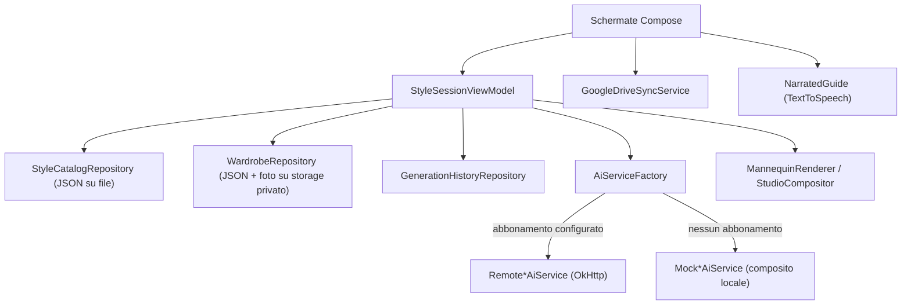

# Product Specification — Style Studio 3D

## 1. Scopo

Applicazione Android per sessioni di styling: capelli, barba, trucco, abbigliamento e scarpe,
con armocromia, prova virtuale e uno "Studio Fotografico" come regia finale prima di generare
uno scatto. Pensata per utenti di qualsiasi genere: nessuna sezione, colore o copy dell'app
presuppone un pubblico maschile o femminile.

## 2. Esperienza utente

### Struttura di navigazione

Un'unica Home con una griglia fissa di otto pulsanti categoria (Capelli & Barba, Trucco,
Abbigliamento, Scarpe, Armocromia, Figura intera, Studio Fotografico, Impostazioni) — nessuno
scorrimento infinito nella navigazione principale. Ogni categoria apre una schermata dedicata;
le griglie interne (stili, capi del guardaroba) restano comunque finite e organizzate per
sottocategoria/tab, non un feed che mischia tutto.

### Linguaggio visivo

- **Palette:** viola-grafite `#241B2F` come colore guida, bronzo caldo `#C9A063` come accento,
  crema `#F6F1EC` come sfondo chiaro — deliberatamente neutra rispetto al genere.
- **Componenti:** Material 3 (Compose), card con bordo evidenziato per lo stato selezionato.

### Tutorial e narrazione

Al primo avvio, un tutorial scritto con un passo per categoria, letto ad alta voce da
`NarratedGuide` tramite il motore TextToSpeech di sistema. La voce e' scelta automaticamente tra
quelle italiane disponibili preferendo la qualita' piu' alta (`Voice.getQuality()`), per evitare
il suono robotico della voce compatta di riserva quando il dispositivo ha di meglio installato.
L'utente puo' disattivare la narrazione, tornare indietro, o saltare il tutorial.

### Catalogo stili: ampio e apribile dall'utente

Il requisito non era "due o tre acconciature": il catalogo di serie ha 65 voci (30 capelli, 15
barbe/baffi, 20 trucchi) con nomi reali da terminologia professionale. Piu' importante, l'utente
puo' aggiungerne quante ne vuole: la schermata "Crea nuovo stile" prende un nome libero (in
qualunque lingua) piu' pochi parametri (lunghezza, volume, texture, colore, intensita', target
audience opzionale) e la nuova voce e' subito nel catalogo, con la sua anteprima.

### Anteprime: procedurale sempre, fotorealistica su richiesta

Non esiste in questo ambiente un motore di generazione immagini per produrre anteprime
fotorealistiche di 65+ stili (e di ogni nuovo stile creato dall'utente). La soluzione adottata:

1. **Anteprima procedurale istantanea** (`StylePreviewRenderer`): un disegno vettoriale di
   viso/spalle che varia forma/estensione/colore in base agli attributi dello stile. Sempre
   presente, gratuita, coerente, generata al volo anche per le voci create un secondo prima.
2. **Slot per anteprima fotorealistica importata**: ogni voce ha un bottone per importare
   un'immagine reale (es. generata in locale dall'utente con ComfyUI o altro strumento AI),
   che sostituisce la miniatura procedurale ovunque venga mostrata quella voce.
3. **Tocco lungo o hover** su qualunque miniatura mostra l'anteprima ingrandita — funziona sia a
   dito (mobile) sia con il puntatore del mouse (PC/emulatore/Chromebook).

## 3. Architettura

- **UI:** un'Activity, Compose + Navigation-Compose, un `StyleSessionViewModel` condiviso per
  tutte le schermate del flusso di styling.
- **Dominio:** modelli immutabili (`StyleCatalogEntry`, `WardrobeItem`, `PhotoStudioSpec`,
  `ColorSeason`, ...) e interfacce per l'IA (`HairMakeupAiService`, `VirtualTryOnService`) con
  implementazioni mock (sempre disponibili) e remote (BYO abbonamento).
- **Dati:** repository leggeri basati su file JSON (`kotlinx.serialization`) e DataStore, senza
  database — coerente con la scala del prototipo; una vera release valuterebbe Room.
- **Sicurezza:** API key e token vivono solo in `SecureCredentialStore`
  (`EncryptedSharedPreferences` su Android Keystore), mai nei file JSON dei repository.
- **Niente framework di dependency injection**: `AppContainer` costruisce a mano il grafo,
  piccolo e stabile abbastanza da non giustificare Hilt/Koin in questo prototipo.

### Il manichino procedurale (non un motore 3D poligonale)

`MannequinRenderer` disegna una silhouette (testa, busto, braccia, gambe) su un `Canvas` Android
nudo, applicando: rotazione (skew orizzontale, -80°..+80°, fronte/tre-quarti/profilo — nessuna
vista posteriore), colori di capelli/barba/trucco/outfit dagli attributi selezionati, tinta di
luce e vignettatura secondo lo Studio Fotografico, sfondo colorato. La stessa funzione serve sia
la preview live in Compose (`MannequinCanvas`, via `drawIntoCanvas`) sia la rasterizzazione su
Bitmap per lo scatto finale — nessuna duplicazione della logica di disegno.

Questa e' una scelta deliberata per l'ambito di questo prototipo: un vero motore 3D (es. Google
Filament/SceneView con un avatar glTF riggato) richiederebbe asset 3D con licenza per un corpo
umano configurabile, una pipeline di texturing per outfit intercambiabili, e un runtime nativo
pesante — tutte cose fuori scope per una prima versione, e impossibili da produrre onestamente in
questa sessione senza asset reali. Il manichino procedurale da' comunque una resa "3D-style"
credibile (rotazione, luci, profondita') restando 100% locale e senza dipendenze binarie pesanti.

## 4. Stati espliciti

| Area | Loading | Success | Error | Empty |
|---|---|---|---|---|
| Editing capelli/barba/trucco | overlay bloccante | foto aggiornata + badge fonte | messaggio leggibile (mai stacktrace) | n/a |
| Prova virtuale | overlay bloccante | foto composita aggiornata | messaggio leggibile | n/a |
| Guardaroba | n/a | griglia capi | n/a | invito a caricare la prima foto |
| Armocromia | n/a | stagione + palette + abbinamenti | n/a | invito ad aggiungere capi |
| Sincronizzazione Drive | stato "Sincronizzazione" | "Connesso" + ultimo orario | messaggio errore con azione "riprova" | n/a |

## 5. Piano QA (non eseguito in questa sessione: nessun Android SDK disponibile nell'ambiente)

- Unit test: `ColorSeasonAnalyzer` (logica di dominio pura, incluso nel repository).
- Da aggiungere: round-trip JSON di `StyleCatalogRepository`/`WardrobeRepository` (richiede
  Robolectric o test strumentali per il `Context`).
- Instrumentation test: onboarding, creazione stile personalizzato, editing IA con mock,
  generazione scatto, rotazione del manichino.
- Device matrix: Android 8–15, TalkBack, font grandi, tema chiaro/scuro, mouse/hover su
  tablet o Chromebook.

## 6. Passaggio a produzione

- Vero test di integrazione contro un abbonamento IA reale (contratto HTTP da confermare/adattare).
- Configurazione OAuth Google Cloud per Drive + persistenza del token tra riavvii.
- Decisione definitiva su un motore di rendering 3D reale, se il prodotto lo richiede oltre il
  manichino procedurale.
- Privacy policy e Data Safety (foto personali, dati del guardaroba, sincronizzazione cloud).
- Firma Play App Signing, build release R8/minify, CI con test automatici (gia' presente per il
  debug in `.github/workflows/build_stylestudio3d_apk.yml`).
